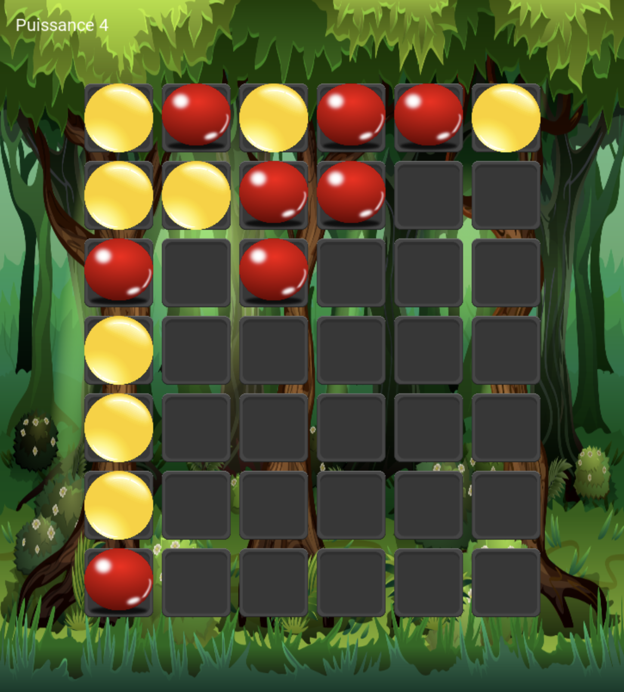

# ConnectFour / Puissance 4 (C and SDL2)

Puissance 4 est un jeu de stratégie classique dont le but est d'aligner une suite de 4 pions de même couleur sur une grille comptant 6 rangées et 7 colonnes.

Chaque joueur dispose de 21 pions d'une couleur (généralement sang et or).

Tour à tour, les deux joueurs placent un pion dans une colonne libre de leur choix.

Le pion "descend" jusqu'à la position la plus basse possible dans la dite colonne à la suite de quoi c'est à l'adversaire de jouer.

Le vainqueur est le joueur qui réalise le premier un alignement (horizontal, vertical ou diagonal) consécutif d'au moins quatre pions de sa couleur.

Si toutes les cases de la grille de jeu sont remplies, aucun des deux joueurs n'a réalisé un tel alignement, la partie est déclarée nulle.

## Install libraries

```bash
# go to https://github.com/libsdl-org/SDL/releases
# Download the SDL2-2.26.1.zip
unzip SDL2-2.26.1.zip
cd SDL2-2.26.1
./configure
make
sudo make install
```

```bash
# go to https://github.com/libsdl-org/SDL_image/releases/
# Download the SDL2_image-2.6.2.zip
unzip SDL2_image-2.6.2.zip
cd SDL2_image-2.6.2
./configure
make
sudo make install
```

```bash
# go to https://github.com/libsdl-org/SDL_ttf/releases/
# Download the SDL2_ttf-2.20.1.zip
unzip SDL2_ttf-2.20.1.zip
cd SDL2_ttf-2.20.1
./configure
make
sudo make install
```

## Compile, Test & Run

```bash
make all

./build/debug/play
```

## Aperçu



## Documentation

### Installer doxygen

```bash
# installer cmake d'abord (https://cmake.org/download/)
git clone https://github.com/doxygen/doxygen.git --depth 1 --branch master
cd doxygen
mkdir build
cd build
cmake -G "Unix Makefiles" ..
make
sudo make install
```

### Génerer la documentation

```bash
doxygen
```


## Valgrind

```bash
# go to https://valgrind.org/downloads/current.html
# Download the valgrind-3.20.0.tar.bz2
tar -xvf valgrind-3.20.0.tar.bz2
cd valgrind-3.20.0
./configure
make
sudo make install
```

```bash
valgrind --leak-check=full --show-leak-kinds=all --track-origins=yes --verbose ./build/debug/play
```
